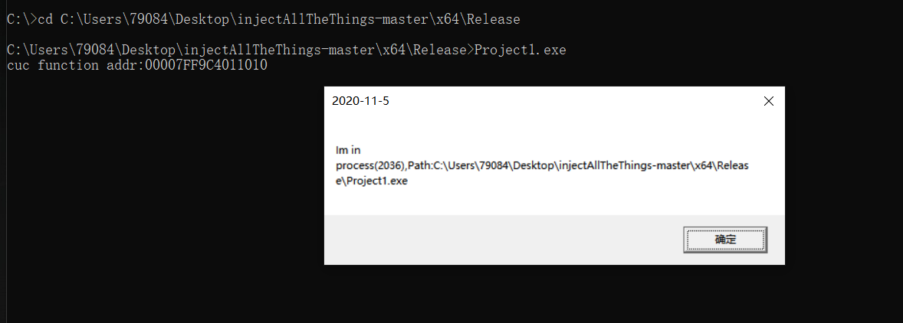

## dll注入实验报告

#### 实验过程

1. 将dllmain.cpp的配置类型改为dll，字符集改为unicode，并修改dllmain函数

 

* 参数ul_reason_for_call指明了被调用的原因。共有4种，即PROCESS_ATTACH、PROCESS_DETACH、THREAD_ATTACH和THREAD_DETACH，以switch语句列出。attach被加载到进程或线程，detach被进程或线程释放

2. 修改dllpoc.cpp文件中的导出函数

 

3. 新建项目Project1,创建loader.cpp

 

4. 生成项目后在工程的/x64/release目录下运行Project1.exe，执行结果如下，弹出窗口显示所在进程PID和路径。

 

5. 按照原文档给的注入方式，注入结果如下，打开记事本，并弹出窗口显示所在进程PID和路径。

注入方式：

```
Usage: injectAllTheThings.exe -t <option> <process name> <full/path/to/dll>
Options:
  1     DLL injection via CreateRemoteThread()
  2     DLL injection via NtCreateThreadEx()
  3     DLL injection via QueueUserAPC()
  4     DLL injection via SetWindowsHookEx()
  5     DLL injection via RtlCreateUserThread()
  6     DLL injection via Code Cave SetThreadContext()
  7     Reflective DLL injection
```

 