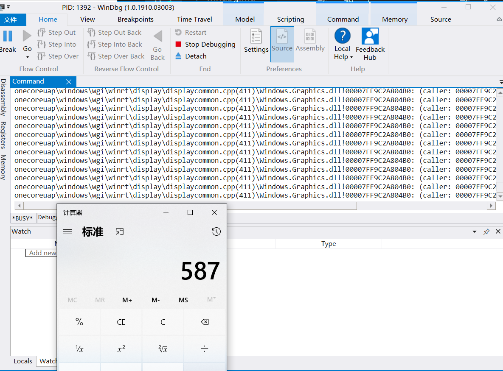
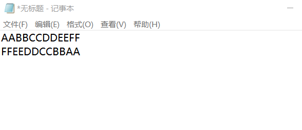
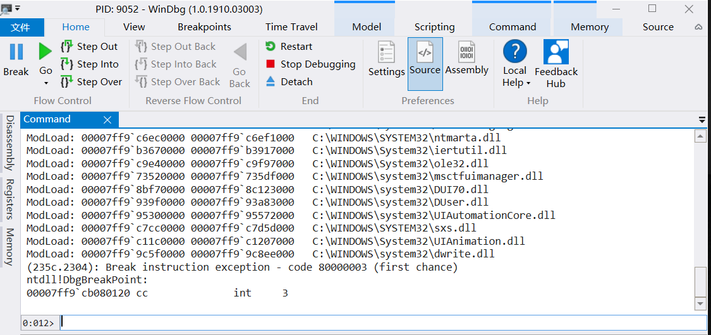
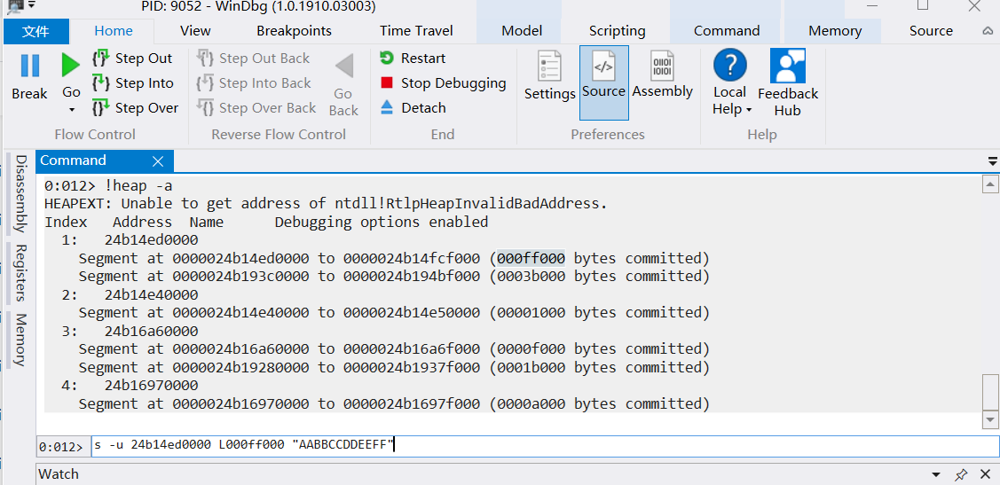
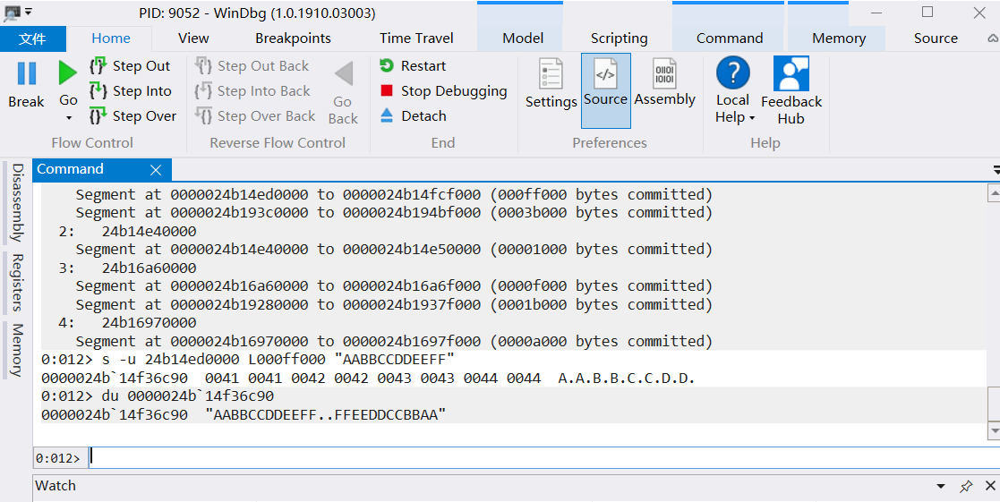
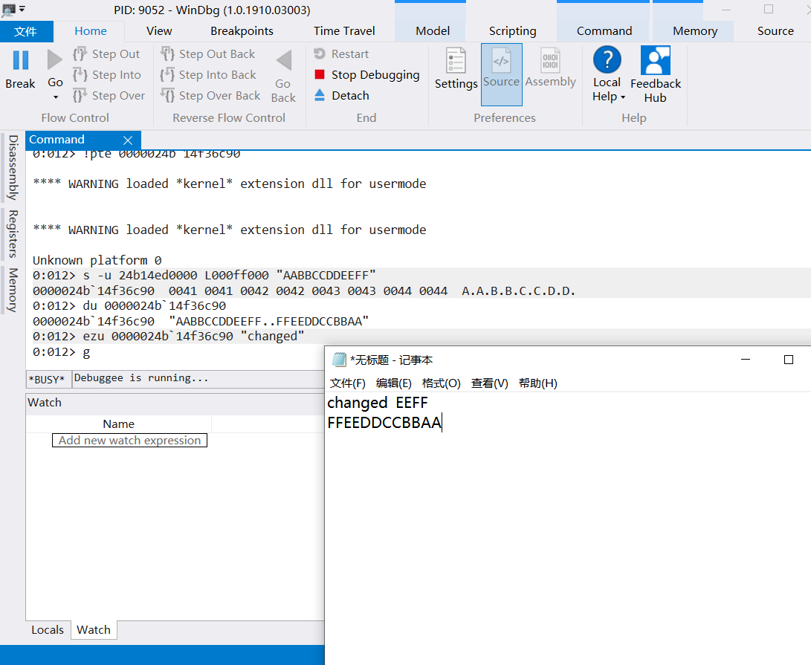

## WinDbg实验报告

#### 实验准备

* 因为是win10所以使用了WinDbg Preview
* 使用db和du查看点击参数值；使用bp下断点，中断后直接执行引号里的命令；使用bl显示当前断点，bd取消所有断点，bc删除特定断点

1. 在win10里尝试修改计算器，在运行```bp User32!SetWindowTextW "du [rbp];g"```后调试时，没有显示所点击数字，并且报错找不到元素



2. 查看calc.exe的导入表发现根本没有调用```SetWindowTextW```这个函数，甚至根本没有```User32.dll```

导入表内容：

```
Microsoft (R) COFF/PE Dumper Version 14.15.26730.0
Copyright (C) Microsoft Corporation.  All rights reserved.


Dump of file C:\Windows\System32\calc.exe

File Type: EXECUTABLE IMAGE

  Section contains the following imports:

    SHELL32.dll
             1400021A0 Import Address Table
             1400028B0 Import Name Table
                     0 time date stamp
                     0 Index of first forwarder reference

                         1B7 ShellExecuteW

    KERNEL32.dll
             140002138 Import Address Table
             140002848 Import Name Table
                     0 time date stamp
                     0 Index of first forwarder reference

                         222 GetCurrentThreadId
                         2F0 GetSystemTimeAsFileTime
                         30E GetTickCount
                         4D3 RtlCaptureContext
                         21E GetCurrentProcessId
                         4E1 RtlVirtualUnwind
                         5BC UnhandledExceptionFilter
                         57B SetUnhandledExceptionFilter
                         21D GetCurrentProcess
                         59A TerminateProcess
                         450 QueryPerformanceCounter
                         4DA RtlLookupFunctionEntry

    msvcrt.dll
             1400021E0 Import Address Table
             1400028F0 Import Name Table
                     0 time date stamp
                     0 Index of first forwarder reference

                          90 __setusermatherr
                         17D _initterm
                          57 __C_specific_handler
                         382 _wcmdln
                         127 _fmode
                          D2 _commode
                          2F ?terminate@@YAXXZ
                          C1 _cexit
                          9D __wgetmainargs
                          AE _amsg_exit
                          55 _XcptFilter
                         432 exit
                          8E __set_app_type
                         10E _exit

    ADVAPI32.dll
             140002118 Import Address Table
             140002828 Import Name Table
                     0 time date stamp
                     0 Index of first forwarder reference

                         122 EventSetInformation
                         129 EventWriteTransfer
                         121 EventRegister

    api-ms-win-core-synch-l1-2-0.dll
             1400021D0 Import Address Table
             1400028E0 Import Name Table
                     0 time date stamp
                     0 Index of first forwarder reference

                          2D Sleep

    api-ms-win-core-processthreads-l1-1-0.dll
             1400021C0 Import Address Table
             1400028D0 Import Name Table
                     0 time date stamp
                     0 Index of first forwarder reference

                          20 GetStartupInfoW

    api-ms-win-core-libraryloader-l1-2-0.dll
             1400021B0 Import Address Table
             1400028C0 Import Name Table
                     0 time date stamp
                     0 Index of first forwarder reference

                          14 GetModuleHandleW

  Summary

        1000 .data
        1000 .pdata
        1000 .rdata
        1000 .reloc
        5000 .rsrc
        1000 .text

``` 

* 放弃在win10里修改计算器

#### 实验过程

* 修改notepad显示的内容

1. 打开notepad并输入一串字符



2. 使用WinDbg```Attach to Process```到notepad.exe



3. 查看notepad.exe已分配的堆



4. 尝试搜索第一个堆，看到AABBCCDD后再du确认一下是否完全匹配



5. 获得字符串首地址后就可以修改内容啦




